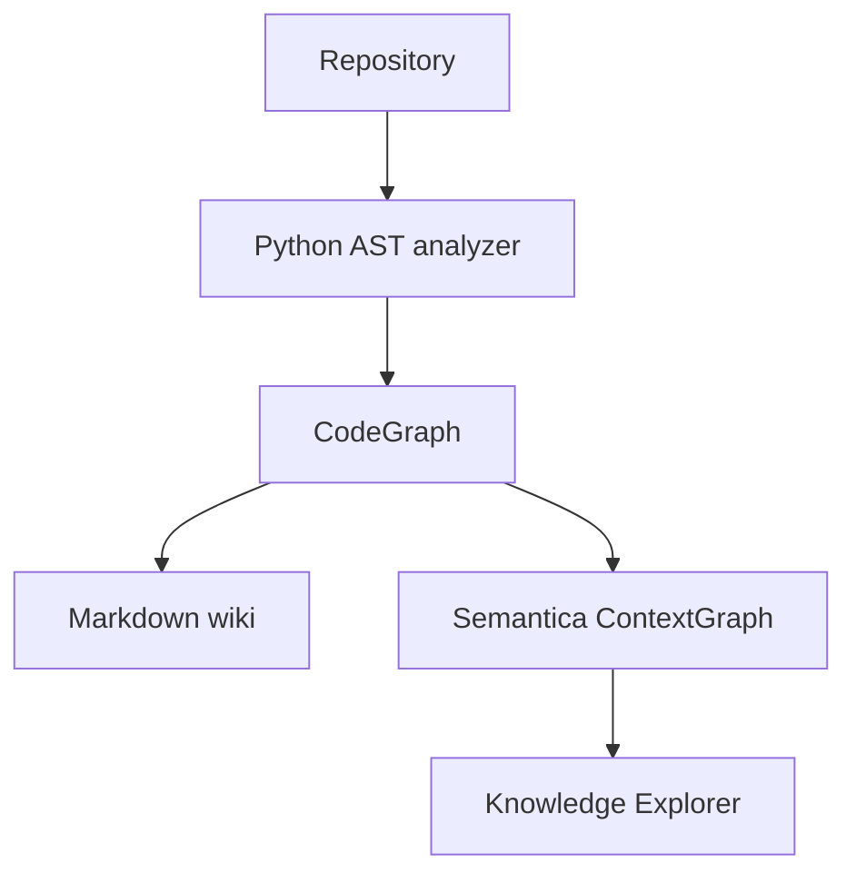

# Semantica Wiki

Graph-native repository wiki proof of concept powered by
[Semantica](https://github.com/semantica-agi/semantica).

The first milestone turns a Python repository into two artifacts:

- a source-linked Markdown code wiki;
- a Semantica `ContextGraph` that can be explored interactively.

## Architecture



## Quick start

Python 3.10 or newer is required.

```bash
python -m venv .venv
source .venv/bin/activate
pip install -e ".[dev]"
semantica-wiki build /path/to/python-repository
```

Generated files:

```text
wiki-output/
├── README.md
└── graph.json
```

Open the graph locally:

```bash
SEMANTICA_ALLOW_ANONYMOUS=true semantica-explorer \
  --graph wiki-output/graph.json
```

## GitHub URL web UI

```bash
semantica-wiki serve --port 8080
```

Open `http://127.0.0.1:8080`, enter a public
`https://github.com/owner/repository` URL, and select **Wiki oluştur**. Each run
is written beneath `.semantica-wiki/runs/`; its Semantica `graph.json` can be
downloaded from the result screen.

Anonymous mode must only be used on localhost. Configure `SEMANTICA_API_KEY`
before exposing Explorer to a network.

## Current graph model

Node types: `Repository`, `File`, `Class`, `Function`, `Method`, `Dependency`.

Relationship types: `CONTAINS`, `DECLARES`, `IMPORTS`.

## Roadmap

- Phase 2: Git URL ingestion, incremental commit-aware indexing and more languages.
- Phase 3: LLM-generated architecture narratives with file/line citations.
- Phase 4: hybrid GraphRAG question answering and sequence diagrams.
- Phase 5: web UI, background jobs, access control and repository webhooks.

## Tests

```bash
pytest
```
