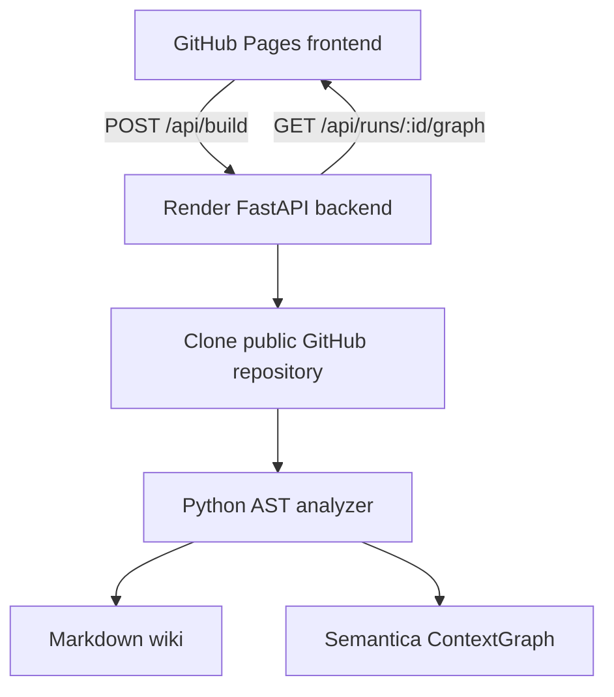

# Semantica Wiki

Graph-native repository wiki proof of concept powered by
[Semantica](https://github.com/semantica-agi/semantica).

The project turns a Python repository into two artifacts:

- a source-linked Markdown code wiki;
- a Semantica `ContextGraph` that can be explored interactively.

## Architecture

Split deployment is supported:

- **Frontend:** static files in [`docs/`](docs/) for GitHub Pages
- **Backend:** FastAPI API in `src/semantica_wiki/web.py` for Render
- **Build output:** each `/api/build` run writes `README.md` and `graph.json` beneath `.semantica-wiki/runs/`



## Quick start

Python 3.10 or newer is required.

```bash
python -m venv .venv
source .venv/bin/activate
pip install -e ".[dev]"
semantica-wiki build /path/to/python-repository
```

Generated files:

```text
wiki-output/
├── README.md
└── graph.json
```

Open the graph locally:

```bash
SEMANTICA_ALLOW_ANONYMOUS=true semantica-explorer \
  --graph wiki-output/graph.json
```

## Local development

```bash
python -m venv .venv
source .venv/bin/activate
pip install -e ".[dev]"
```

Run the backend:

```bash
semantica-wiki serve --host 0.0.0.0 --port 8080
```

Serve the static frontend from `docs/` in a separate terminal:

```bash
python -m http.server 8000 -d docs
```

Then open `http://127.0.0.1:8000` and set the backend base URL to
`http://127.0.0.1:8080`.

Anonymous mode must only be used on localhost. Configure `SEMANTICA_API_KEY`
before exposing Explorer to a network.

## Render deployment

This repository includes [`render.yaml`](render.yaml) for a web service deployment.

1. Create a new **Blueprint** or **Web Service** on Render from this repository.
2. Use the generated `render.yaml`, or configure the same command manually:

   ```bash
   uvicorn semantica_wiki.web:app --host 0.0.0.0 --port $PORT
   ```

3. Set `SEMANTICA_CORS_ALLOW_ORIGINS` to a comma-separated list of allowed frontend origins.
   For GitHub Pages on this repo, use:

   ```text
   https://karabasnejat.github.io
   ```

4. Deploy and copy the Render service URL.

## GitHub Pages deployment

The workflow [`.github/workflows/deploy-pages.yml`](.github/workflows/deploy-pages.yml)
deploys the `docs/` directory to GitHub Pages on pushes to `main`.

1. In GitHub, enable **Settings → Pages → Build and deployment → GitHub Actions**.
2. Update `docs/config.js` with your Render base URL, or leave it blank and enter the URL in the UI after deploy.
3. Push to `main` or run the workflow manually.
4. Open the published Pages URL, typically:

   ```text
   https://karabasnejat.github.io/semantica/
   ```

Because the frontend uses relative asset paths (`./app.js`, `./styles.css`), it works under the repository subpath used by GitHub Pages.

## Frontend backend configuration

The Pages frontend can target the backend in two ways:

- set `window.SEMANTICA_CONFIG.apiBaseUrl` in `docs/config.js`
- enter a backend base URL in the UI; it is saved to `localStorage`

The frontend expects the backend to expose:

- `GET /api/health`
- `POST /api/build`
- `GET /api/runs/{run_id}/graph`

## Current graph model

Node types: `Repository`, `File`, `Class`, `Function`, `Method`, `Dependency`.

Relationship types: `CONTAINS`, `DECLARES`, `IMPORTS`.

## Roadmap

- Phase 2: Git URL ingestion, incremental commit-aware indexing and more languages.
- Phase 3: LLM-generated architecture narratives with file/line citations.
- Phase 4: hybrid GraphRAG question answering and sequence diagrams.
- Phase 5: web UI, background jobs, access control and repository webhooks.

## Tests

```bash
pytest
```
